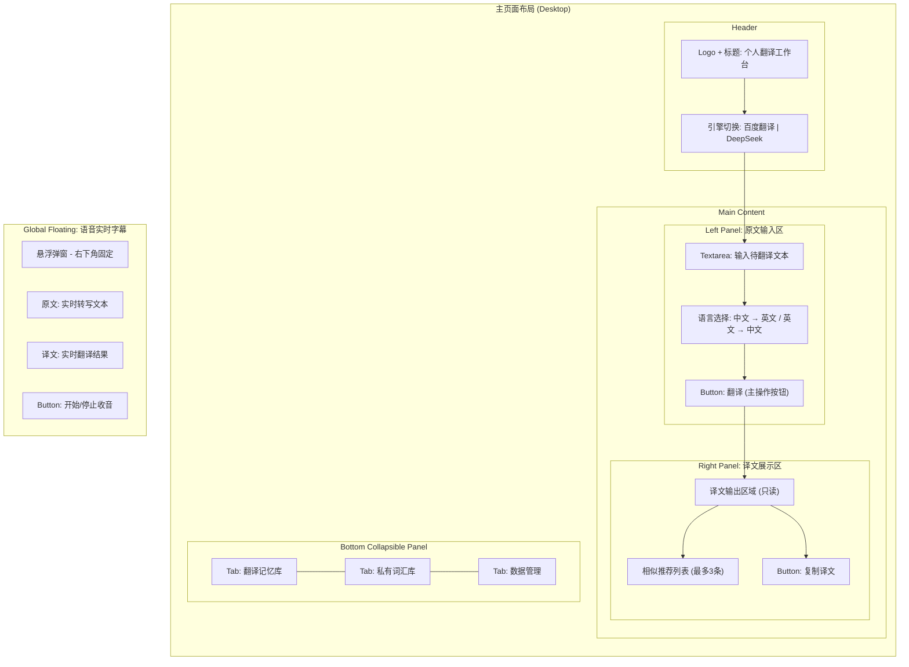
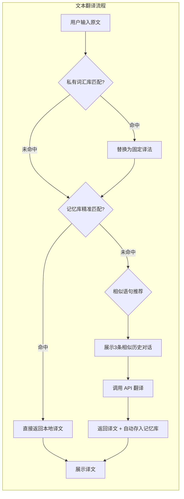
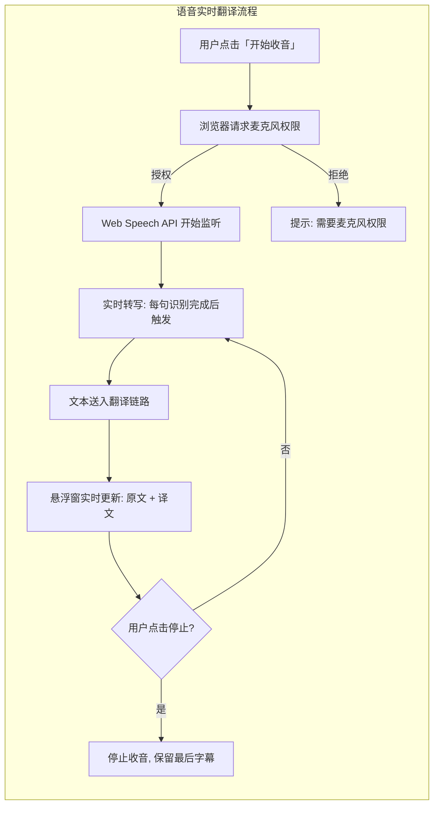
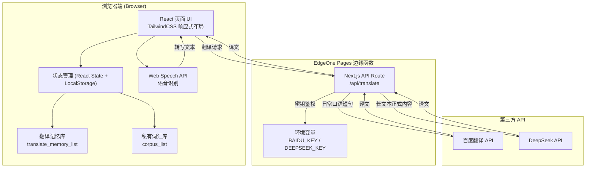

# 个人网页翻译工作台 — 产品需求文档 (PRD)

> **文档状态**: 草稿 v0.1  
> **创建日期**: 2026-06-23  
> **作者**: 个人项目  
> **产品定位**: 个人自用翻译工具 | 日常交流文本翻译 + 麦克风语音实时翻译

---

## 1. 产品定位

一句话定位：**专为个人日常跨语言交流打造的轻量翻译工作台，文本输入 + 语音实时翻译双模式，所有数据本地存储、零成本部署。**

核心价值主张：

- **双模式覆盖**：手动输入翻译（聊天文案、短句）+ 语音实时翻译（面对面交流、网课字幕），一个工具满足两种高频需求。
- **翻译记忆复用**：历史对话自动入库，重复话术秒出译文，大幅节省 API 调用费用。
- **私有语料定制**：自定义俚语、口头禅、固定短句的译法，确保个人表达习惯翻译统一。
- **隐私零泄露**：所有对话数据仅存浏览器 LocalStorage，不上传任何云端服务器。
- **零成本永久可用**：EdgeOne Pages 免费部署，国内网络直连，浏览器书签即用。

---

## 2. 需求背景

### 2.1 触发来源

日常跨语言交流场景中，现有翻译工具存在明显痛点：

- 通用翻译工具（Google Translate、DeepL 等）每次翻译都是"一次性"的，无法记住用户的常用表达和固定译法，同一条口语短句反复输入反复翻译，效率低且浪费 API 额度。
- 语音翻译场景下，多数工具需要手动切换 App、无法同时看到原文和译文，面对面交流时操作割裂。
- 现有工具的数据存储在云端，个人对话内容存在隐私顾虑。

### 2.2 不解决的后果

- 重复翻译高频日常对话，时间与 API 费用双重浪费。
- 口语交流场景缺乏趁手的实时字幕工具，跨语言沟通效率低下。
- 个人习惯用语（俚语、口头禅、专属称谓）翻译不一致，表达效果打折扣。

### 2.3 证据标注

- `[PM 假设]` 个人日常交流中约 30%-50% 为重复话术，可通过记忆库直接复用。
- `[PM 假设]` 浏览器原生 Web Speech API 可满足日常口语转写需求，延迟可接受。

---

## 3. 产品目标

### 3.1 核心目标

| 目标 | 衡量标准 |
|------|---------|
| 文本翻译可用 | 中英双向翻译，支持百度/DeepSeek 双引擎切换，结果准确可读 |
| 语音实时翻译可用 | 麦克风收音 → 实时转文字 → 同步翻译，延迟 < 2 秒 |
| 记忆库复用 | 相同原文走本地匹配，不发起 API 请求 |
| 私有词汇替换 | 自定义词汇在翻译前强制替换，替换率 100% |
| 数据持久化 | 关闭浏览器重新打开，记忆库、词汇库数据完整恢复 |

### 3.2 非目标（黑名单 — 永久不做）

- 图片 OCR 翻译
- 屏幕录屏识别字幕
- 用户账号登录 / 注册
- 云端数据同步
- 付费功能
- 多人协作

---

## 4. 用户与使用场景

### 4.1 用户画像

**唯一用户：工具开发者本人**（个人自用，无需多角色划分）。

- 语言能力：中英双语使用者，英语非母语
- 使用频率：日常高频（每天数次）
- 设备：电脑浏览器为主，手机浏览器为辅
- 核心痛点：重复翻译浪费时间、语音交流缺乏实时字幕工具

### 4.2 核心使用场景

| 优先级 | 场景 | 描述 |
|--------|------|------|
| P0 | 文本翻译 | 微信/社交软件聊天文字复制粘贴翻译、生活笔记文本翻译 |
| P0 | 语音实时翻译 | 面对面口语交流实时字幕、外语网课实时翻译 |
| P1 | 记忆库管理 | 查看历史翻译、删除无用记录、一键清空 |
| P1 | 词汇库管理 | 手动添加/CSV 批量导入固定短语翻译 |
| P2 | 数据备份 | CSV 导出记忆库/词汇库，换浏览器恢复 |

---

## 5. 功能需求

### 5.1 功能总览表

| # | 模块 | 功能描述 |
|---|------|---------|
| 1 | 文本输入翻译 | 中英双向手动输入文本（原文区），实时展示翻译结果（译文区）。支持百度翻译 / DeepSeek 双引擎切换。翻译执行前按优先级链路：私有词汇替换 → 记忆库精准匹配 → 相似语句推荐 → API 翻译 → 自动存入记忆库。 |
| 2 | 语音实时翻译 | 浏览器原生 Web Speech API 收音，实时转写原文并同步调用翻译接口，右下角悬浮弹窗双语展示原文 + 译文。一键开启/停止。 |
| 3 | 翻译记忆库 | 自动保存所有翻译成功的句对（原文 + 译文 + 语种 + 使用次数 + 时间），相同原文更新使用次数不重复存储。底部折叠面板查看全部记录，支持单条删除、一键清空。 |
| 4 | 私有语料词汇库 | 手动逐条添加或 CSV 批量导入自定义词汇（短语 + 固定译文 + 语种 + 分类），翻译时优先级最高，强制替换原文中的匹配短语。底部折叠面板管理，支持导出 CSV。 |
| 5 | 数据管理 | 记忆库、词汇库支持 CSV 导出备份、CSV 导入恢复。底部面板提供操作入口。 |

### 5.2 页面布局原型



### 5.3 模块详细设计

---

#### 模块 1: 文本输入翻译

**原型示意图：**



**功能描述：**

- **业务逻辑**: 用户输入原文 → 选择语种方向（中→英/英→中）→ 点击翻译。系统按固定优先级链路执行：私有词汇替换 → 记忆库精准匹配 → 相似推荐 → API 翻译 → 自动入库。翻译结果展示在右侧译文区，同时展示最多 3 条相似历史对话供点击快速填充。
- **交互逻辑**: 点击"翻译"按钮 → 按钮显示 loading 状态 → 翻译完成 → 译文区渲染结果。相似推荐以卡片列表形式展示在译文区下方，点击卡片将对应译文填充到译文区。引擎切换为顶部单选按钮，切换后立即生效，不影响已翻译内容。
- **规则约束**: 原文输入框：textarea，不限长度，必填。语言方向：默认中→英，记忆上次选择。引擎选择：默认百度翻译，记忆上次选择。
- **边界与异常**: 原文为空时，"翻译"按钮置灰不可点击。API 请求超时（> 10s）提示"翻译超时，请重试"。API 返回错误时展示错误信息，不存入记忆库。

---

#### 模块 2: 语音实时翻译

**原型示意图：**



**功能描述：**

- **业务逻辑**: 用户点击"开始收音" → 浏览器请求麦克风权限 → Web Speech API 开始实时语音识别 → 每识别出一个完整句子，自动送入翻译链路（同文本翻译优先级） → 悬浮窗实时展示原文 + 译文。翻译成功的句对自动存入记忆库。
- **交互逻辑**: 悬浮窗右下角固定，始终置顶（z-index 最高），可拖拽移动位置。收音中：按钮显示"停止收音" + 红色脉冲动画。未收音：按钮显示"开始收音"。悬浮窗最小高度固定，内容超出自动滚动到最新。
- **规则约束**: 语音识别语言：默认中文（可通过设置切换）。悬浮窗尺寸：宽度 360px，高度自适应（最大 400px），半透明背景。
- **边界与异常**: 浏览器不支持 Web Speech API → 提示"当前浏览器不支持语音识别，请使用 Chrome"。麦克风权限被拒绝 → 提示引导用户去浏览器设置开启。长时间无声音输入 → 不处理，保持等待状态不自动关闭。

---

#### 模块 3: 翻译记忆库

**数据结构：**

| 字段 | 类型 | 说明 |
|------|------|------|
| id | string (UUID) | 唯一标识 |
| sourceText | string | 原文内容 |
| targetText | string | 译文内容 |
| lang | string | 语种方向 (zh→en / en→zh) |
| useCount | number | 使用次数 |
| createdAt | string (ISO) | 创建时间 |

**存储键**: `translate_memory_list`

**功能描述：**

- **业务逻辑**: 每次文本翻译或语音翻译成功后自动保存句对。相同原文（sourceText + lang 完全一致）仅更新 useCount +1 和 createdAt，不重复存储。精准匹配：输入原文与记忆库中 sourceText 完全一致时，直接返回 targetText，跳过 API。模糊推荐：使用简单的字符串相似度（如 Levenshtein 距离或包含匹配），返回相似度最高的 3 条记录。
- **交互逻辑**: 底部折叠面板 → "翻译记忆库" Tab → 列表展示所有记录（原文、译文、语种、使用次数、时间），按时间倒序。每条记录右侧有删除按钮（红色，需二次确认）。顶部有"一键清空"按钮（红色，需二次确认）。支持搜索过滤原文内容。
- **边界与异常**: 记忆库为空时展示空状态："暂无翻译记录，开始翻译后自动保存"。单条删除后列表即时刷新。一键清空后不可恢复，二次确认文案："确定清空所有翻译记忆？此操作不可恢复。"

---

#### 模块 4: 私有语料词汇库

**数据结构：**

| 字段 | 类型 | 说明 |
|------|------|------|
| id | string (UUID) | 唯一标识 |
| sourcePhrase | string | 原文短语 |
| targetPhrase | string | 固定译文 |
| lang | string | 语种方向 |
| category | string | 分类（俚语/口头禅/称谓/其他） |
| createdAt | string (ISO) | 创建时间 |

**存储键**: `corpus_list`

**功能描述：**

- **业务逻辑**: 翻译执行第一步——遍历词汇库，将原文中匹配到的 sourcePhrase 替换为 targetPhrase（区分大小写、全词匹配），替换后的文本再进入后续翻译链路。优先级高于记忆库和 API 翻译。
- **交互逻辑**: 底部折叠面板 → "私有词汇库" Tab → 列表展示所有词条。顶部操作栏：手动添加按钮（弹出表单：原文短语、固定译文、语种、分类）、CSV 导入按钮（打开文件选择器）、CSV 导出按钮（下载 CSV 文件）。每条词条可编辑、删除。
- **规则约束**: CSV 导入格式：`sourcePhrase,targetPhrase,lang,category`，首行为列头。导入时去重：相同 sourcePhrase + lang 视为重复，覆盖旧数据。
- **边界与异常**: 词汇库为空时展示空状态："暂无私有词汇，添加常用短语后可自动替换"。CSV 格式错误时提示具体行号及错误原因。导入前预览变更数量，用户确认后执行。

---

#### 模块 5: 数据管理

**功能描述：**

- **业务逻辑**: 提供记忆库和词汇库的 CSV 导入导出功能。导出时将对应 localStorage 数据转为 CSV 格式触发浏览器下载。导入时解析 CSV 文件并合并到现有数据（去重规则同各模块）。
- **交互逻辑**: 底部折叠面板 → "数据管理" Tab → 四个操作卡片：导出记忆库、导入记忆库、导出词汇库、导入词汇库。每个卡片有明确的操作按钮和说明文字。
- **边界与异常**: 导出时数据为空 → 提示"暂无数据可导出"。导入时文件非 CSV 格式 → 提示"请选择 CSV 格式文件"。导入数据量过大（> 10000 条）→ 提示"数据量较大，可能需要几秒钟"。

---

## 6. 技术架构



**翻译执行流水线：**

```
用户输入原文
    │
    ▼
私有词汇库强制替换 (corpus_list)
    │
    ▼
记忆库精准匹配 (translate_memory_list)
    │ 命中 → 返回本地译文 (0 API 消耗)
    │ 未命中
    ▼
相似语句推荐 (Levenshtein 距离, 最多3条)
    │
    ▼
调用 /api/translate → 百度翻译 / DeepSeek
    │
    ▼
返回译文 + 自动存入记忆库
```

---

## 7. 竞品参考

| 维度 | 通用翻译工具 (Google/DeepL/Baidu) | 语音翻译 App | 本项目 |
|------|----------------------------------|-------------|--------|
| 文本翻译 | 支持 | 部分支持 | 支持 |
| 语音实时翻译 | 部分支持 | 支持 | 支持 |
| 翻译记忆复用 | 不支持 | 不支持 | 核心功能 |
| 私有词汇定制 | 部分支持（术语库） | 不支持 | 核心功能 |
| 数据隐私 | 上传云端 | 上传云端 | 纯本地存储 |
| 部署成本 | 免费 | 免费/付费 | 零成本 |
| 国内网络访问 | 需代理 | 可用 | 可用 |

**差异定位**: 本项目不做"大而全"的翻译平台，而是聚焦个人日常交流场景，通过记忆复用和私有词汇两项能力，让高频对话翻译成本趋近于零。

---

## 8. 路线图

| 阶段 | 内容 | 预计周期 |
|------|------|---------|
| **MVP (v0.1)** | 文本输入翻译 + 百度翻译 API 接入 + 记忆库自动存储 + LocalStorage | 1-2 周 |
| **v0.2** | 语音实时翻译（Web Speech API）+ 悬浮窗双语字幕 | 1 周 |
| **v0.3** | 私有词汇库（手动添加 + CSV 导入）+ 翻译优先级链路完整实现 | 1 周 |
| **v0.4** | DeepSeek API 接入 + 引擎切换 + 相似语句推荐 | 1 周 |
| **v1.0** | 数据管理（CSV 导入导出）+ 底部折叠面板 + 移动端适配 + EdgeOne Pages 部署 | 1 周 |

---

## 9. 验收标准

| # | 验收项 | 通过标准 |
|---|--------|---------|
| 1 | 文本翻译 | 输入中文/英文，点击翻译，1-3 秒内返回可读译文；切换引擎后使用对应 API |
| 2 | 记忆库精准匹配 | 输入与记忆库完全相同的原文，不发起 API 请求，直接返回译文 |
| 3 | 私有词汇替换 | 原文包含自定义短语时，翻译结果使用固定译法，不调用 API 翻译该短语 |
| 4 | 语音实时翻译 | 麦克风开启后，说话内容在 2 秒内完成转写和翻译，悬浮窗正确展示双语 |
| 5 | 自动入库 | 翻译成功后，记忆库新增/更新一条记录，刷新页面后数据不丢失 |
| 6 | 浏览器兼容 | Chrome 最新版完整可用；Safari/Firefox 文本翻译可用，语音功能提示不支持 |
| 7 | 移动端适配 | 手机浏览器打开，左右分栏自动变为上下布局，悬浮窗可正常显示 |
| 8 | 部署 | 推送 GitHub 后 EdgeOne Pages 自动部署，生成可访问公网链接 |
| 9 | 安全 | 浏览器开发者工具中无法找到 API 密钥原文 |
| 10 | 数据持久化 | 关闭浏览器标签页重新打开，记忆库和词汇库数据完整恢复 |

---

## 10. 风险与依赖

| 风险 | 影响 | 缓解策略 |
|------|------|---------|
| Web Speech API 浏览器兼容性 | 语音功能在部分浏览器不可用 | 检测 API 可用性，不支持时给出明确提示引导使用 Chrome |
| 百度翻译 API 额度限制 | 超出免费额度后翻译失败 | 记忆库复用降低调用频率，超出时友好提示 |
| EdgeOne Pages 部署政策变化 | 可能影响免费部署 | 项目纯静态前端 + 边缘函数，可迁移至 Vercel/Netlify |
| LocalStorage 容量限制 (5-10MB) | 记忆库过大时存储失败 | 估算每条记录约 200 字节，5MB 可存约 25000 条，日常够用；提供导出备份和清空功能 |
| 语音识别准确率 | 口语转写错误导致翻译偏差 | 用户可手动修正转写文本后再翻译（v1.1 规划） |

---

> **标注说明**: 本文档中标注 `[PM 假设]` 的内容为基于个人使用经验的推断，上线后根据实际使用数据验证和调整。标注 `[待确认]` 的内容需在开发前明确。